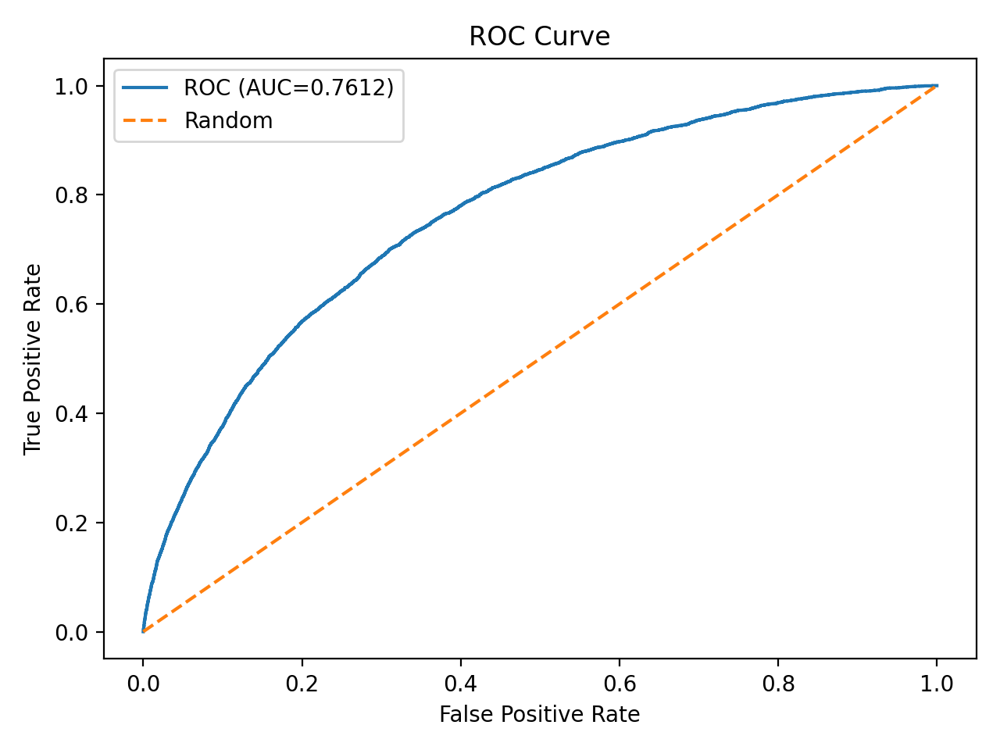
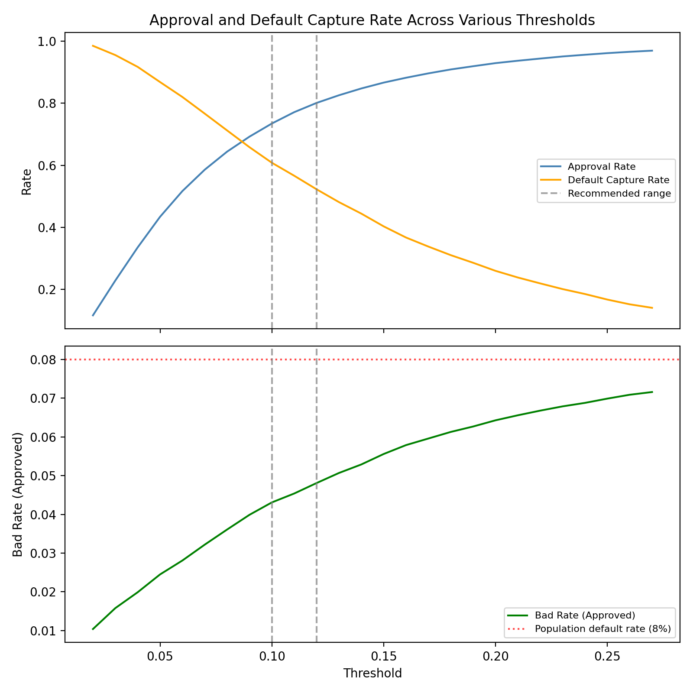

# Credit Risk  PD Modelling - Home Credit

--- 

## Objective 
Build an end-to-end Probability of Default (PD) model using real-world consumer lending data. The focus 
is on correct ML system design, leakage discipline, and credit-specific evaluation.
with a focus on correctness, reproducability, and professional ML practices. 

**Current status:** C1 complete (application-level) data
**ROC AUC: 0.761 | KS: 0.390 | PR-AUC: 0.238**

### Dataset
Home Credit Default Risk ([Kaggle](https://www.kaggle.com/competitions/home-credit-default-risk/overview_))

Scope (current):
- Application-level data only (`application_train.csv`)
- 307,511 loan applications
- 8% default rate (class imbalance confirmed)
- Behavioural tables deferred to later phase 4

---

## Results

| Metric | Value |
|---|---|
| ROC AUC | 0.761 |
| KS Statistic | 0.390 |
| PR-AUC | 0.238 |
| Top decile default capture | 33% |
| Top two deciles default capture | 51% |

At threshold 0.10: 73.5% approval rate, 60.8% default capture, 
approved portfolio bad rate of 4.3% vs population rate of 8.0%.

Full evaluation: docs/model_card.md

### ROC Curve


### Threshold Plot


---

## Repository Structure 

```
src/
    features/
        feature_engineering.py   # domain-justified feature transforms
        preprocessing.py         # leakage-safe preprocessing pipeline
    models/
        baseline.py              # logistic regression pipeline
        evaluate.py              # evaluation functions
        metrics.py               # KS statistic
        run_evaluation.py        # produces report artifacts
        train_baseline.py        # training entry point
    config.py                    # feature version and experiment config

notebooks/
    01_eda_application_train.ipynb
    02_baseline_evaluation.ipynb
    03_threshold_analysis.ipynb

docs/
    model_card.md                # full experiment record and findings

results/
    experiments.csv              # tracked experiment log
```

---

## Key Design Decisions

**Leakage prevention:** All preprocessing fit on training data only. 
Target separated before any transformation.

**Calibration:** class_weight='balanced' retained for score spread. 
Following this, Platt scaling was then applied to restore probability 
interpretability. A model predicting PD=0.10 should default 
roughly 10% of the time — uncalibrated it would not.

**Experiment tracking:** Each feature version and hyperparameter 
change is logged in results/experiments.csv with versioned 
artifact folders. Config-driven pipeline means any experiment 
is reproducible from a single config change.

---

## Project Roadmap
- Phase 0: Environment and repository structure
- Phase 1: Leakage-safe preprocessing pipeline 
- Phase 2: Feature egineering, baseline model, evaluation
- Phase 3: Threshold analysis
- Phase 4: Bureau and behavioural data integration,
            WOE/IV analysis, stress testing 

