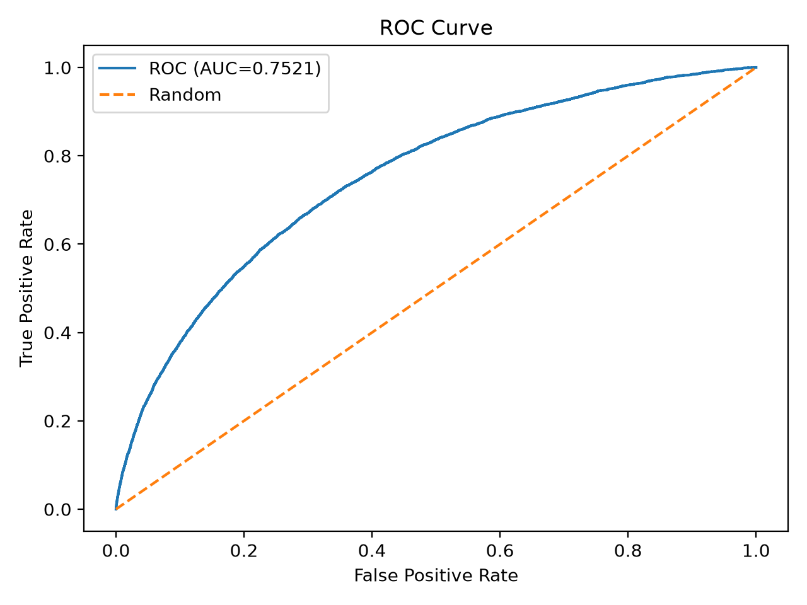
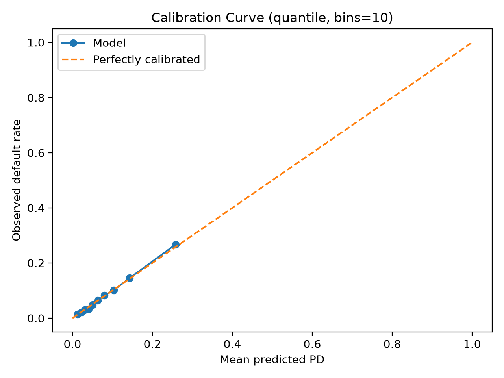
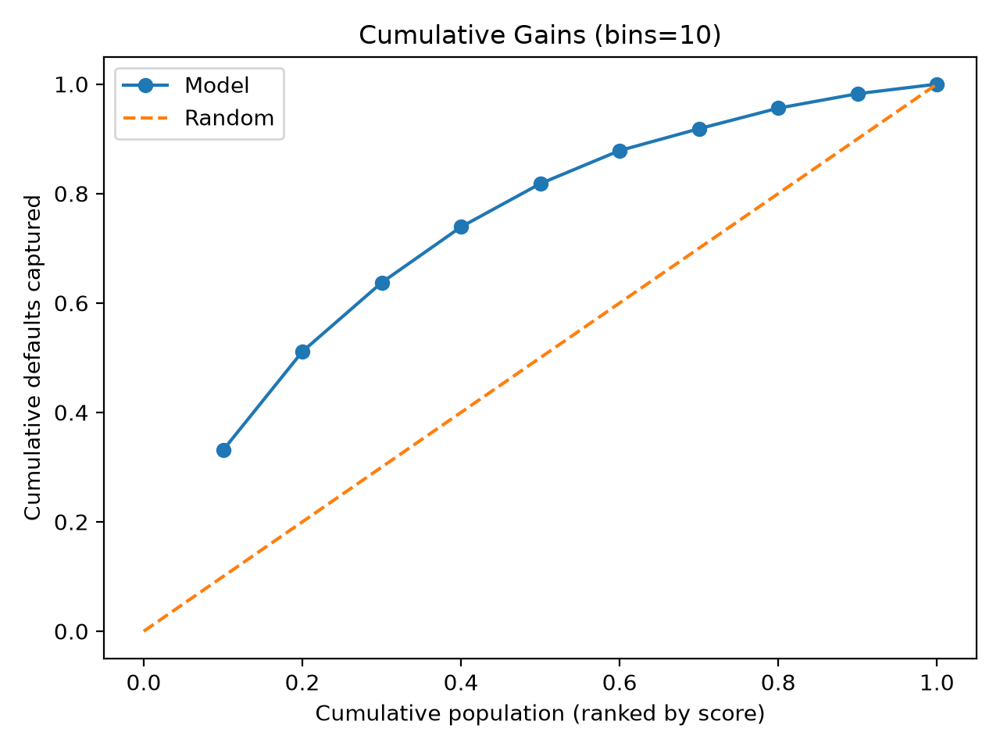
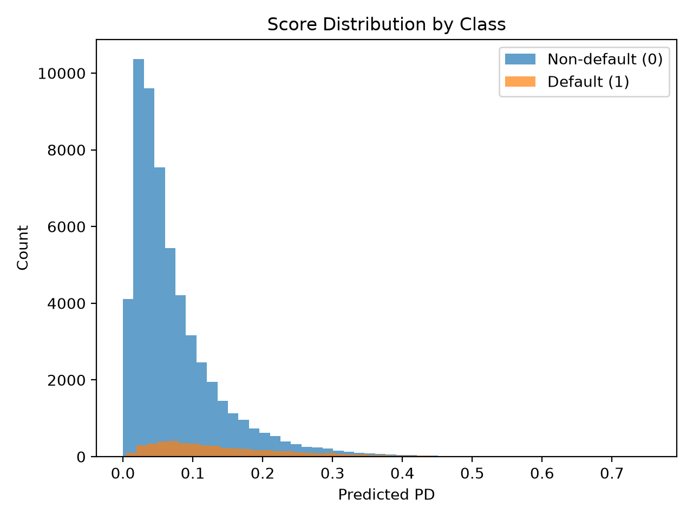
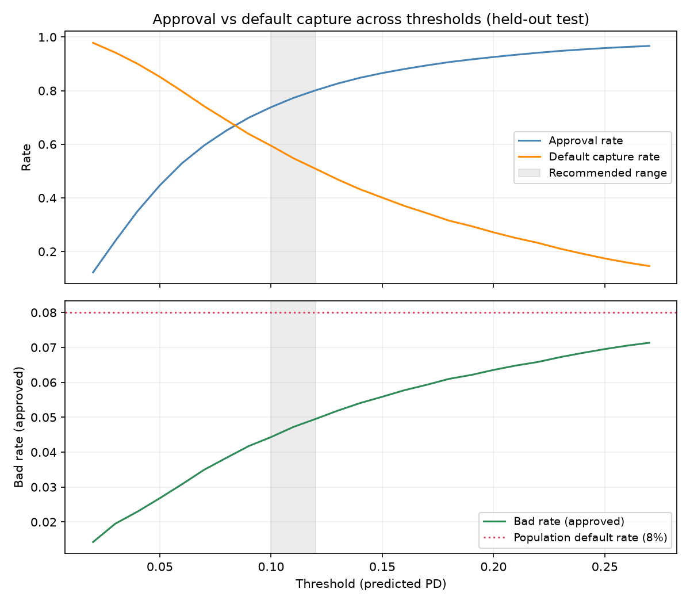

# Credit-Risk PD Modelling — Home Credit

An end-to-end **Probability of Default (PD)** model on real consumer-lending data,
built with a focus on **correct ML system design, leakage discipline, and
credit-specific evaluation**. Namely, more than just a headline accuracy number.

**Status:** application-level model complete · evaluated on a held-out test set
touched exactly once.

| ROC AUC | KS | PR-AUC |
|:---:|:---:|:---:|
| **0.752** | **0.373** | **0.235** |

> Reported on a stratified **held-out test set** (scored once). 5-fold cross-validation
> on the training set gives AUC **0.749 ± 0.002**, which agrees with the test result —
> evidence the model generalizes rather than overfitting the evaluation data.

---

## Dataset

Home Credit Default Risk ([Kaggle](https://www.kaggle.com/competitions/home-credit-default-risk/overview))

- Application-level data only (`application_train.csv`) — 307,511 applications
- ~8% default rate (class imbalance handled explicitly)
- Bureau / behavioural tables deferred to a later phase

---

## Results

**Model:** Logistic Regression in an sklearn `Pipeline`. That is, median imputation, 
`StandardScaler`, `OneHotEncoder`, `class_weight='balanced'`, with Platt scaling
for calibrated probabilities.

| Metric | Value |
|---|---|
| ROC AUC | 0.752 |
| KS statistic | 0.373 |
| PR-AUC | 0.235 |
| Top-decile default capture | 33% |
| Top-two-decile default capture | 51% |

**Operating point (0.10 PD cut-off):** 73.8% approval rate, 59.5% of all defaults
caught in the reject pile, and a **4.4% bad rate in the approved book** - roughly half
the 8% population default rate.

<table>
  <tr>
    <td align="center"><br><b>ROC</b></td>
    <td align="center"><br><b>Calibration</b></td>
  </tr>
  <tr>
    <td align="center"><br><b>Cumulative gains</b></td>
    <td align="center"><br><b>Score distribution</b></td>
  </tr>
</table>

### Threshold to business decision

The model is the easy part; the real question is **where you draw the approve/reject
line**. This is a business decision with a quantifiable cost either way. The chart below traces
approval rate, default capture, and the approved-book bad rate across candidate PD
thresholds; the shaded band marks the recommended **0.10–0.12** operating range.

<p align="center"></p>

Full analysis and expected-loss framing: [`docs/model_card.md`](docs/model_card.md) and
[`notebooks/03_threshold_analysis.ipynb`](notebooks/03_threshold_analysis.ipynb).

---

## Repository Structure

```
credit-risk-pd/
├── config.py                       # RunConfig dataclass; experiment control surface
├── requirements.txt                # pipeline dependencies (pinned)
├── requirements-dev.txt            # + notebook / EDA extras
├── src/
│   ├── run_evaluation.py           # entry point: orchestrates a full training + evaluation run
│   ├── score.py                    # single-applicant PD scoring from the saved model
│   ├── tracking.py                 # experiment records (run.json) + cross-run comparison view
│   ├── features/
│   │   ├── feature_engineering.py  # domain-justified feature transforms
│   │   └── preprocessing.py        # leakage-safe ColumnTransformer + train/test split
│   ├── models/
│   │   ├── baseline.py             # logistic-regression pipeline definition
│   │   └── pipeline.py             # steps: load -> split -> build -> train -> persist
│   └── evaluation/
│       ├── evaluate.py             # ROC / PR / calibration / gains, coefficients, CV
│       └── metrics.py              # KS statistic
├── notebooks/
│   ├── 01_eda_application_train.ipynb
│   └── 03_threshold_analysis.ipynb
├── docs/
│   ├── model_card.md               # model card: findings & limitations
│   └── figures/                    # figures used in this README
├── reports/                        # per-run artifacts: figures, tables, model.joblib, run.json  (gitignored)
└── results/
    └── experiments.csv             # frozen legacy run log (superseded by reports/*/run.json)
```

---

## Running it

```bash
# Train + calibrate + evaluate + persist the model, and write a run record
python -m src.run_evaluation

# Compare runs (reads every reports/*/run.json into one table)
python -m src.tracking

# Score a single applicant from the saved model, no retraining (demo)
python -m src.score
```

---

## Key Design Decisions

**Leakage discipline.**
- `TARGET` is separated before any transform; every transformer is fit on training data
  only (the `ColumnTransformer` keeps fit/transform honest by construction).
- One stratified **held-out test set**, scored exactly once. That is, no feature choice,
  threshold, or calibration is ever informed by it.
- Platt calibration is fit on the training set via internal CV folds, so the reported
  metrics never see the calibration data.

**Calibration.**
- `class_weight='balanced'` is kept for score separation; Platt scaling then restores
  probability meaning. Namely, a predicted PD of 0.10 should default ~10% of the time, which an
  uncalibrated, class-weighted score would not.

**Experiment tracking.**
- A `RunConfig` **dataclass** is the single control surface, injected as a parameter
  rather than read as a global.
- Every run writes a complete, self-describing **`run.json`** (resolved config + metrics
  + **git commit SHA** + working-tree-dirty flag) beside its artifacts — the record is
  complete by construction, so adding a config knob never touches a writer.
- `load_runs()` rebuilds a cross-run comparison table on demand from those records; the
  git SHA pins the exact code behind each result, making a run reproducible from its record.

**Reproducibility.**
- Fixed random seed throughout; the fitted model is persisted with `joblib`, so a single
  applicant can be scored on demand without retraining.

---

## Roadmap

- ✅ Leakage-safe preprocessing, feature engineering, calibrated baseline model
- ✅ Correctness pass: held-out test set, calibration-on-train, k-fold CV
- ✅ Architecture: decomposed pipeline, model persistence, single-applicant scoring
- ✅ Experiment tracking: `RunConfig` + per-run `run.json` + git provenance
- ▢ Own the findings: threshold -> expected-loss narrative, refreshed model card
- ▢ One modelling extension: embedded feature selection **or** a tree ensemble vs. LR
- ▢ Bureau & behavioural data, WOE/IV, stress testing
